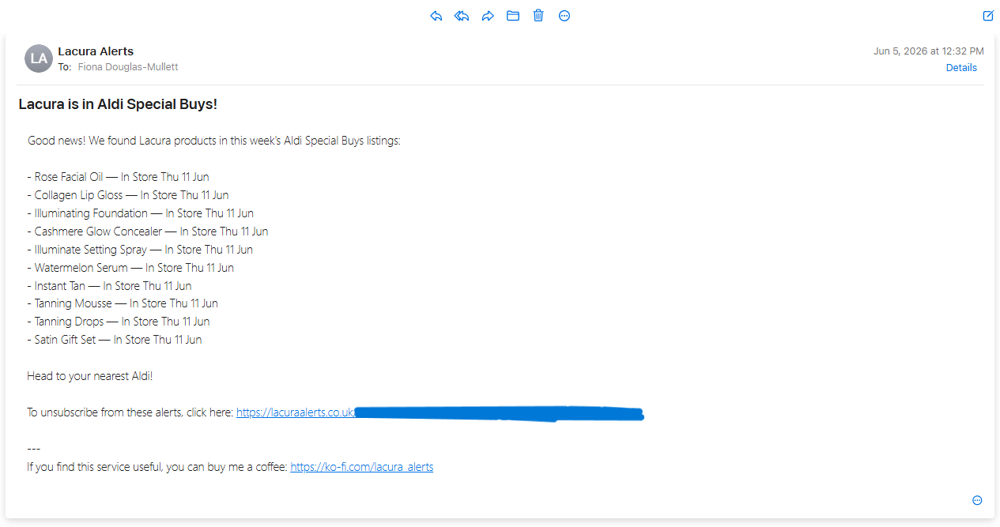
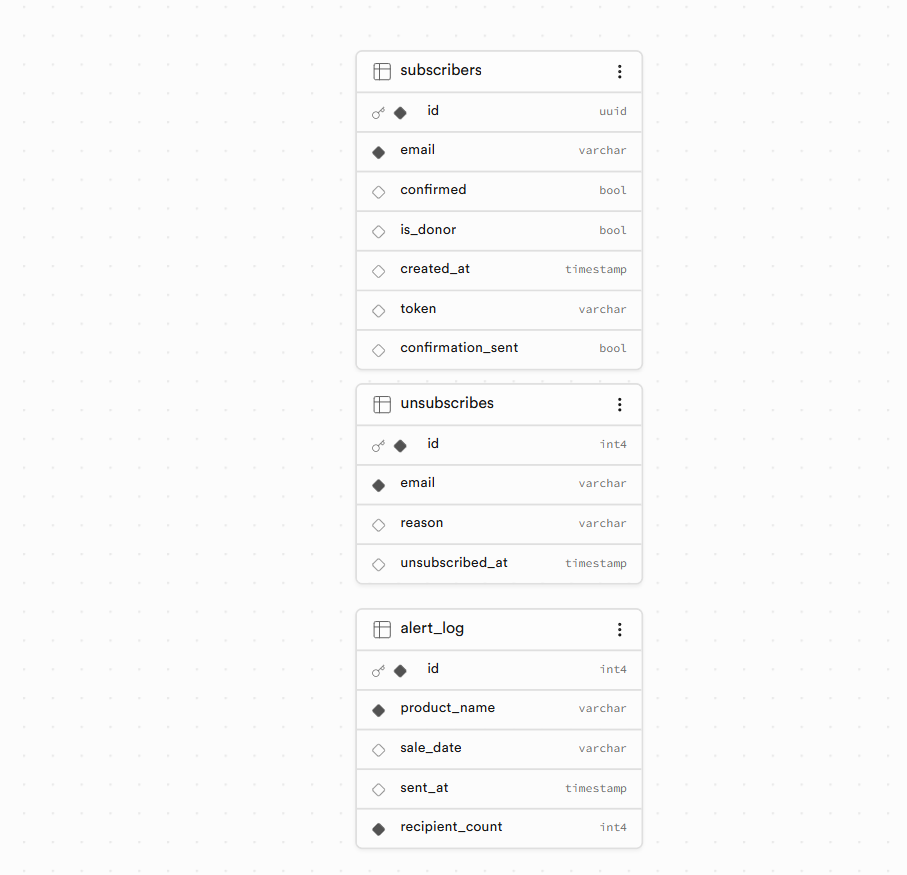

# Aldi Lacura Alert 🛁

## 📌 Project Brief

A personal automation project built to solve a genuine problem. Aldi's 
Lacura skincare range has two tiers: everyday products available in store 
year-round, and a separate Special Buys range that only appears for limited 
periods. It's the Special Buys range that the skincare and beauty community 
gets excited about.

These are high-quality dupes for cult premium products. Think La Mer 
Concentrate, Sunday Riley Good Genes, Drunk Elephant, Elemis, Glow Recipe, 
and Pixi, available at a fraction of the price. The catch is they're only 
released occasionally, sell out fast, and if you miss the window, you wait 
until the next drop. By the time most people notice they're in the Special 
Buys listing, they're already gone.

This tool monitors the Aldi Special Buys health and beauty page specifically, 
detects when Lacura Special Buy products appear, and automatically emails all 
confirmed subscribers before they miss out.

It runs entirely in the cloud with no local dependencies, triggered 
automatically on a schedule via GitHub Actions.

---

## 🛠️ Technologies & Tools Used

| Category | Tools / Libraries |
|---|---|
| **Languages** | Python |
| **Web Scraping** | BeautifulSoup, Requests |
| **Database** | PostgreSQL hosted on Supabase |
| **Email** | Brevo (transactional email API) |
| **Automation** | GitHub Actions (scheduled workflows) |
| **Subscriber Management** | HTML sign-up and unsubscribe pages |
| **Hosting** | GitHub Pages (lacuraalerts.co.uk) |

---

## 🌐 Sign-Up Page

*Subscribers sign up at lacuraalerts.co.uk and receive a confirmation 
email before being added to the active list.*

---

## ⚙️ How It Works

The system has two separate automated workflows:

**1. Aldi Lacura Scraper** (runs on a schedule via GitHub Actions)
- Scrapes the Aldi Special Buys health and beauty page
- Identifies any products where the brand name contains "Lacura"
- Checks the Supabase database to avoid sending duplicate alerts within 
  the last 30 days
- If new products are found, emails all confirmed subscribers with product 
  names, sale dates, and an unsubscribe link
- Logs each alert to the database including recipient count

**2. Confirmation Emails** (triggered when a new subscriber signs up)
- Sends a confirmation email to new subscribers via Brevo
- Subscriber is only added to the active list once they confirm
- Each subscriber has a unique token used to manage unsubscribes securely

---

## 📧 Example Alert Email

*A real alert email sent to subscribers showing Lacura products found in 
Aldi Special Buys, with sale dates and a one-click unsubscribe link.*

---

## 🗄️ Database Schema

*Three-table PostgreSQL database hosted on Supabase. The subscribers table 
manages confirmed sign-ups with unique tokens, alert_log records every alert 
sent with recipient counts, and unsubscribes tracks opt-outs with reasons and 
timestamps.*

---

## 🔒 Security & Credential Management

All sensitive credentials (Supabase URL and key, Brevo API key, sender 
email) are stored as GitHub Actions secrets and loaded at runtime via 
environment variables. No credentials are stored in the codebase.

A `.gitignore` ensures no local `.env` files are accidentally committed.

---

## 📦 File Structure

| File | Description |
|---|---|
| `scraper.py` | Main scraping and email alert script |
| `send_confirmation.py` | Handles confirmation emails for new subscribers |
| `index.html` | Subscriber sign-up page (hosted at lacuraalerts.co.uk) |
| `confirm.html` | Email confirmation landing page |
| `unsubscribe.html` | Unsubscribe landing page |
| `.github/workflows` | GitHub Actions workflow definitions |
| `requirements.txt` | Python dependencies |

---

## ✅ Summary

This project demonstrates a fully cloud-deployed, production-ready 
automation pipeline, from web scraping and data validation through to 
database management and transactional email delivery, running continuously 
without any local infrastructure.

It was built to solve a real problem and has real subscribers receiving 
real alerts.
